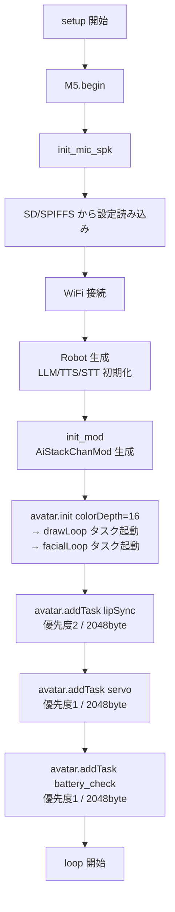
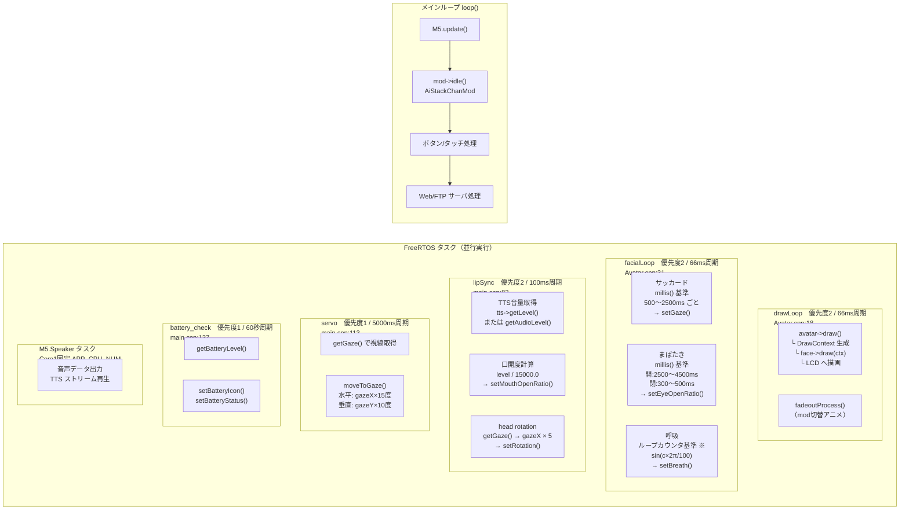
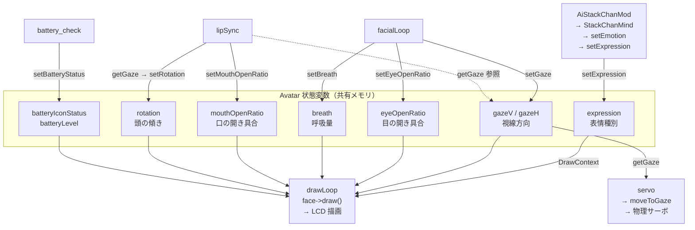
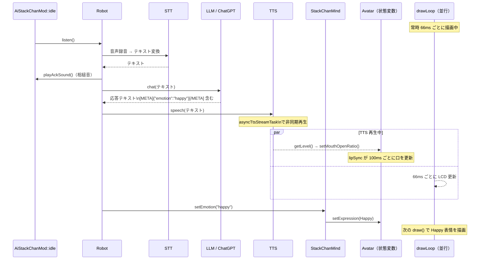

# アバター処理フロー図

## 1. 初期化フロー（setup）

---

## 2. ランタイム タスク構成

> ※ 呼吸の `c` は毎 66ms でインクリメントされるためループ速度に依存する（vTaskDelay 変更で速度が変わる）

---

## 3. Avatar 状態変数と読み書き関係

---

## 4. 会話中の処理フロー（AiStackChanMod::idle）

---

## 備考

| タスク | 周期 | 実効 fps | 依存タイミング |
|---|---|---|---|
| drawLoop | 66ms | 約15fps | 固定（ハードコード） |
| facialLoop | 66ms | 約15fps | サッカード/まばたき: millis()基準、呼吸: カウンタ基準 |
| lipSync | 100ms | 約10fps | 固定（ハードコード） |
| servo | 5000ms | 0.2Hz | IdleLookAround が直接制御するときは無効 |
| battery_check | 60000ms | 毎分 | — |
